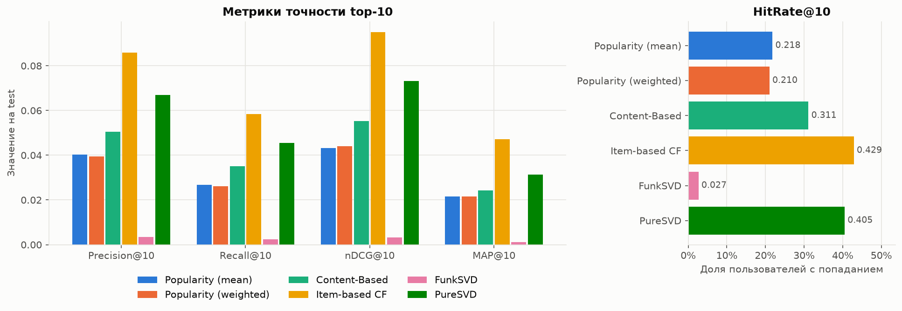
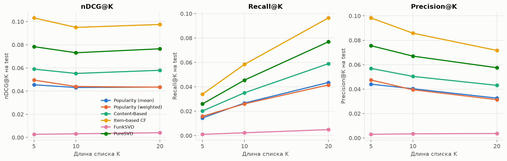
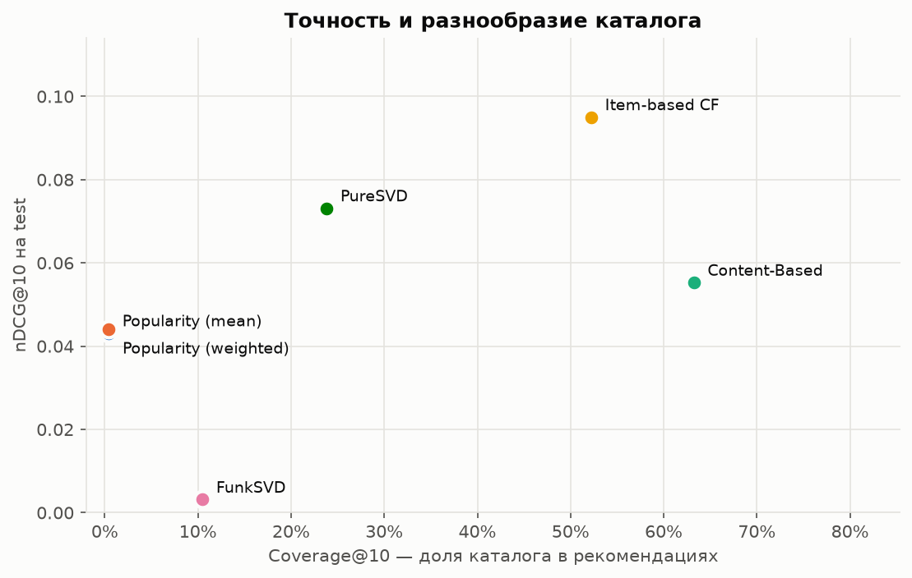
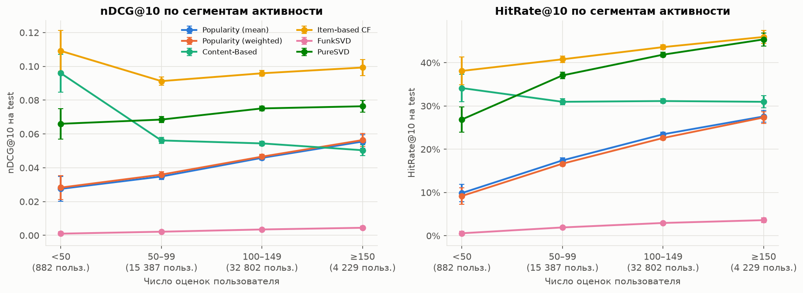
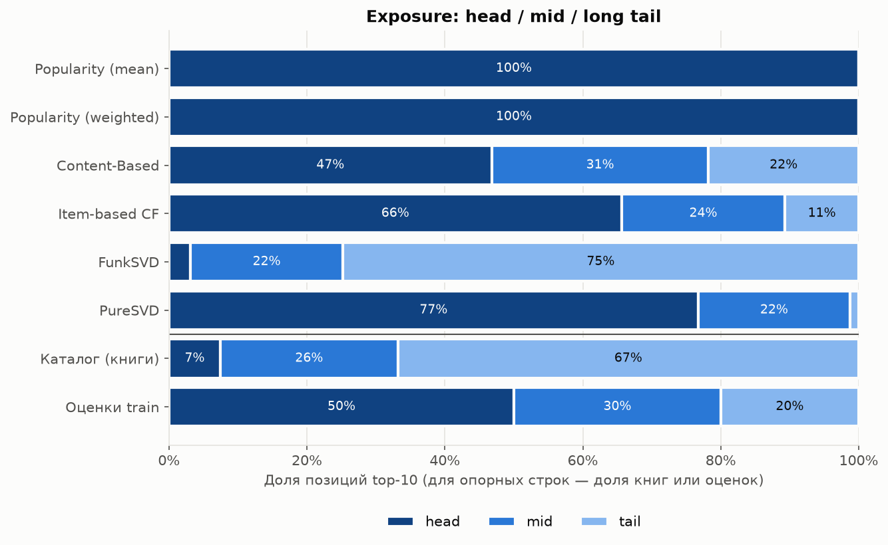
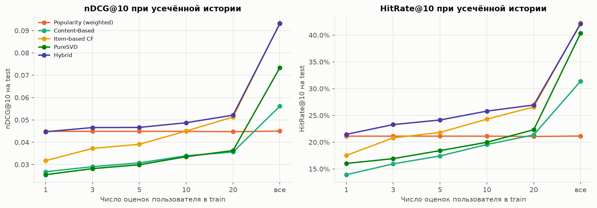

# Прототип книжного рекомендательного сервиса (goodbooks-10k)

## Задача

Построение и сравнение рекомендательных моделей для сервиса подбора книг на датасете goodbooks-10k:

1. Разведочный анализ данных (EDA): распределение оценок, активность пользователей, популярность книг и long tail, теги, проблемы данных (sparsity, popularity bias, cold start).
2. Базовые модели: неперсонализированная Popularity (Top-N по среднему рейтингу с порогом числа оценок) и Content-Based (TF-IDF по названию и тегам, cosine similarity).
3. Item-based Collaborative Filtering на разреженной матрице «пользователь × книга».
4. Matrix Factorization: SVD, оценка ошибки предсказания RMSE.
5. Сравнение top-N моделей по Precision@K, Recall@K, nDCG@K на отложенной выборке.
6. Гибридная стратегия для cold start, выводы и пути улучшения.

## Основные результаты

- Лучшая модель top-N — **Item-based CF**: на test nDCG@10 **0.095**, HitRate@10 42.9 %; PureSVD — 0.073, Content-Based — 0.055, Popularity — 0.044 (раздел 5).
- Наименьшая ошибка предсказания оценки — **FunkSVD**: RMSE **0.844** против 0.858 у BaselineOnly, но для ранжирования он непригоден (nDCG@10 0.003): качество по RMSE не переносится на top-N (разделы 4.3, 5.2).
- Popularity bias: на 7.5 % книг приходится 50 % оценок train, точные модели отдают этим книгам 66–77 % позиций выдачи; Content-Based — 47 % (раздел 5.4).
- Cold start: при истории до 5 оценок Popularity точнее Item-based CF. **Гибрид** (Item-based CF + Popularity с весом по длине истории, Content-Based для новых книг) лучше обеих моделей при истории 3–20 оценок и рекомендует книги без оценок при потере nDCG@10 1.6 % (раздел 6).

## Данные

Согласно инструкции на странице датасета на Kaggle (https://www.kaggle.com/datasets/zygmunt/goodbooks-10k), используется актуальная версия датасета из репозитория автора на GitHub: https://github.com/zygmuntz/goodbooks-10k.

Причина: версия на Kaggle устарела. Она содержит дубликаты оценок и около 980 тыс. оценок, отобранных примерно по 100 на книгу, что искажает распределение популярности книг и активности пользователей. Актуальная версия содержит все оценки без дубликатов, отсортированные по времени; порядок строк позволяет построить временное разбиение на обучающую и тестовую выборки. Статистики со страницы Kaggle относятся к устаревшей версии и в работе не используются.

Лицензия датасета: CC BY-SA 4.0.

| Файл | Строк | Содержимое |
|---|---:|---|
| `ratings.csv` | 5 976 479 | Оценки `user_id, book_id, rating` (1–5), строки упорядочены по времени |
| `books.csv` | 10 000 | Метаданные книг: `book_id`, `goodreads_book_id`, авторы, `original_title`, `title`, год, агрегаты рейтинга |
| `tags.csv` | 34 252 | Справочник тегов `tag_id, tag_name` |
| `book_tags.csv` | 999 912 | Теги книг `goodreads_book_id, tag_id, count` |

Идентификаторы непрерывны: книги 1–10 000, пользователи 1–53 424. Теги связываются с книгами через `books.goodreads_book_id`. Результаты проверки целостности: дубликатов пар `(user_id, book_id)` и пропусков в оценках нет; все ссылки между таблицами корректны; в `book_tags.csv` 8 повторяющихся пар `(goodreads_book_id, tag_id)` и 6 записей с неположительным `count`; у 585 книг отсутствует `original_title`.

## Структура репозитория

```
Rec_Systems_HW1/
├── README.md
├── requirements.txt          # закреплённые версии зависимостей
├── pyproject.toml            # пакет recsys, настройки ruff и pytest
├── scripts/
│   └── download_data.py      # загрузка CSV с GitHub в data/raw/
├── src/recsys/
│   ├── config.py             # пути, RANDOM_STATE, параметры протокола оценки, словари тегов
│   ├── data.py               # загрузка, валидация данных, очистка тегов
│   ├── eda.py                # статистики EDA: активность, популярность, Gini, теги
│   ├── split.py              # per-user temporal split
│   ├── metrics.py            # Precision@K, Recall@K, nDCG@K, MAP@K, HitRate@K, Coverage, Novelty, RMSE
│   ├── evaluation.py         # набор оценки, top-K батчами, сводные таблицы, сегменты, exposure
│   ├── cold_start.py         # симуляция cold start: усечение истории, скрытие книг
│   ├── plots.py              # графики в едином стиле, сохранение в reports/figures/
│   └── models/
│       ├── base.py           # интерфейс Recommender: fit, score, recommend с исключением train
│       ├── popularity.py     # Popularity: средний рейтинг с порогом, weighted rating, count
│       ├── content.py        # Content-Based: TF-IDF (название + теги), get_similar_books
│       ├── item_cf.py        # Item-based CF: sparse-схожесть, shrinkage, top-K соседей, predict
│       ├── svd.py            # FunkSVD (surprise) и PureSVD (scipy svds), векторизованный top-N
│       └── hybrid.py         # гибрид Item-based CF + Popularity + Content-Based для cold start
├── notebooks/
│   └── goodbooks_recsys.ipynb  # основной ноутбук с результатами
├── tests/                    # тесты метрик, разбиения, оценки и моделей (pytest)
├── reports/figures/          # графики для README
└── data/raw/                 # исходные CSV (не входят в репозиторий)
```

## 1. Разведочный анализ данных (EDA)

Подробности (промежуточные таблицы, вспомогательные графики, кривая Лоренца, проверка порядка строк) — ноутбук, раздел 1.

| Показатель | Значение |
|---|---:|
| Оценок / пользователей / книг | 5 976 479 / 53 424 / 10 000 |
| Заполненность матрицы «пользователь × книга» | 1.12 % (sparsity 98.88 %) |
| Средняя / медианная оценка | 3.92 / 4 |
| Доля оценок ≥ 4 | 69.0 % |
| Оценок на пользователя: мин. / медиана / макс. | 19 / 111 / 200 |
| Оценок на книгу: мин. / медиана / макс. | 8 / 248 / 22 806 |
| Gini числа оценок: книги / пользователи | 0.61 / 0.13 |

### 1.1. Распределение оценок


Распределение смещено к высоким оценкам: 4 и 5 — 69.0 %, 1–2 — 8.1 %. Причина — selection bias явных откликов: чаще оцениваются прочитанные и понравившиеся книги. Отсюда порог релевантности `rating ≥ 4`: он отделяет положительный отклик от нейтрального (3) и отрицательного (1–2); при пороге 3 релевантными были бы 92 % оценок, и метрики ранжирования слабо различали бы модели. Чувствительность выводов к порогу (≥ 4 против = 5) — раздел 5.5.

### 1.2. Активность пользователей


| Сегмент (число оценок) | Пользователей | Доля пользователей | Доля оценок |
|---|---:|---:|---:|
| `<50` — малоактивные | 899 | 1.7 % | 0.6 % |
| `50–99` | 15 441 | 28.9 % | 22.2 % |
| `100–149` | 32 849 | 61.5 % | 65.7 % |
| `≥150` — активные | 4 235 | 7.9 % | 11.5 % |

Датасет отфильтрован автором: у каждого пользователя не менее 19 оценок, классического cold start нет; ближайший сегмент — `<50` (в train от 15 оценок). Cold start исследуется сегментным анализом (раздел 5.3) и симуляцией (раздел 6). Средняя оценка снижается с активностью (4.00 в нижнем дециле, 3.86 в верхнем) — нужен учёт смещения пользователя (центрирование в Item-based CF, `b_u` в SVD).

### 1.3. Популярность книг и long tail


На топ-10 % книг приходится 53.2 % оценок. По накопленной доле оценок каталог делится на head (849 книг, 8.5 % каталога, 50 % оценок), mid (2 764 книги, 30 % оценок) и long tail (6 387 книг, 63.9 % каталога, 20 % оценок, не более 346 оценок на книгу). Модели склонны рекомендовать head, поэтому кроме точности контролируются Coverage, Novelty и доля head в выдаче (раздел 5.4); схожести книг long tail в Item-based CF ненадёжны из-за малого числа общих читателей. Средняя оценка книги от популярности почти не зависит (3.87–3.92 по децилям) — Popularity по среднему рейтингу требует порога числа оценок.

### 1.4. Теги


Теги пользовательские и зашумлены: служебные теги (`to-read`, `currently-reading`, `owned`, `kindle`, `favorites`, `read-in-2015` и т.п.) составляют 44 % записей `book_tags` и 80 % суммарного числа присвоений и не описывают содержание книги. После удаления служебных тегов и нормализации синонимов (`science-fiction` → `sci-fi`, `ya` → `young-adult`) у книги в среднем 53 тега (исходно 100); самые частые — жанровые: `fiction`, `fantasy`, `young-adult`, `classics`, `sci-fi`, `romance`.

### 1.5. Проблемы данных

| Проблема | Проявление | Следствие для моделей |
|---|---|---|
| Sparsity | Заполнено 1.12 % матрицы | `scipy.sparse`; малые пересечения пользователей у пар книг → ненадёжные схожести, shrinkage |
| Popularity bias, long tail | Gini 0.61; 8.5 % книг дают 50 % оценок, 64 % книг — 20 % | Популярные книги релевантны многим: Popularity — лучшая модель при истории до 5 оценок; точные модели отдают head 66–77 % выдачи; контроль Coverage, Novelty, exposure |
| Смещение оценок | 69 % оценок ≥ 4 | Порог релевантности 4; учёт смещений пользователя и книги |
| Cold start | В исходных данных отсутствует (≥ 19 оценок на пользователя, ≥ 8 на книгу) | Сегментный анализ; симуляция усечением истории и скрытием книг; гибрид (раздел 6) |
| Шум тегов | 80 % присвоений — служебные теги, синонимы | Очистка и нормализация перед TF-IDF |
| Смещение выборки | Каталог — 10 000 самых популярных книг | Метрики оптимистичнее, чем в сервисе с полным каталогом |

Строки `ratings.csv` упорядочены по глобальному времени (оценки пользователя не сгруппированы в блоки), что обосновывает per-user temporal split по порядку строк.

## 2. Протокол оценки, Popularity, Content-Based

Подробности (подбор параметров, промежуточные таблицы, примеры выдачи) — ноутбук, раздел 2.

### 2.1. Разбиение

**Per-user temporal split**: последние по порядку строк 20 % оценок каждого пользователя (`round(0.2 · n)`, не менее одной) — test, остальные — train. Порядок строк глобально хронологический (раздел 1.5): модель обучается на прошлом и оценивается на будущем каждого пользователя, и у каждого оцениваемого пользователя есть история в train — в отличие от глобального разреза по времени; случайный split смешивал бы прошлое и будущее. Подбор параметров — на том же разбиении train (train_inner / valid), test используется однократно для итогового сравнения.

| Часть | Оценок | Пользователей | Доля оценок ≥ 4 |
|---|---:|---:|---:|
| train | 4 781 208 | 53 424 | 69.1 % |
| test | 1 195 271 | 53 424 | 68.3 % |
| train_inner | 3 824 978 | 53 424 | 69.6 % |
| valid | 956 230 | 53 424 | 67.4 % |

Все статистики моделей строятся только по обучающей части; `tests/test_split.py` проверяет отсутствие пересечений частей, порядок во времени и вложенность valid в train.

### 2.2. Релевантность и метрики

Релевантная книга — книга из отложенной части с оценкой **≥ 4** (обоснование — раздел 1.1). Оцениваются пользователи с хотя бы одной релевантной книгой: на valid — фиксированная выборка **10 000** пользователей (`RANDOM_STATE = 42`), на test — все (раздел 5). Книги из train пользователя исключаются из выдачи. Метрики усредняются по пользователям; K ∈ {5, 10, 20}, основная точка сравнения — K = 10.

| Метрика | Формула | Что измеряет |
|---|---|---|
| Precision@K | \|rec@K ∩ rel\| / K | Долю релевантных книг в выдаче |
| Recall@K | \|rec@K ∩ rel\| / \|rel\| | Долю найденных релевантных книг пользователя |
| nDCG@K | DCG@K / IDCG@K, DCG@K = Σᵢ relᵢ / log₂(i + 1) | Качество с учётом позиции: попадание на 1-м месте весит больше, чем на 10-м |
| MAP@K | среднее AP@K = (1 / min(K, \|rel\|)) · Σᵢ P@i · relᵢ | Точность на позициях попаданий |
| HitRate@K | доля пользователей с ≥ 1 попаданием | Долю пользователей, получивших хотя бы одну полезную рекомендацию |
| Coverage@K | \|∪ᵤ rec@K\| / \|каталог train\| | Разнообразие выдачи по каталогу, popularity bias |
| Novelty@K | среднее −log₂ p(i), p(i) — доля оценок книги в train | Непопулярность рекомендаций: выше — больше long tail |

- IDCG@K строится по min(K, \|rel\|) релевантным книгам всей отложенной части пользователя, а не по выданному списку (иначе nDCG завышается); relᵢ ∈ {0, 1}.
- Знаменатель Recall@K — все релевантные книги (среднее \|rel\| в valid — 12.2), поэтому при K ≤ 10 максимум Recall@K обычно меньше 1.
- Метрики векторизованы по матрице попаданий и проверены тестами на примерах с ручным расчётом (`tests/test_metrics.py`).

### 2.3. Popularity

Общий список для всех пользователей за вычетом прочитанного. Варианты скора книги i (v_i — число оценок в train, R_i — средняя оценка, C — глобальное среднее): **mean** (требуемый) — R_i среди книг с v_i ≥ m; **weighted rating** — WR_i = v_i / (v_i + m) · R_i + m / (v_i + m) · C; **count** — v_i.

Без порога top-10 по среднему состоит из книг с единичными оценками 5 (nDCG@10 = 0.0005). Порог выбран на valid как максимум nDCG@10 при полном заполнении top-10: **m = 7 000** (пул 49 книг); при m ≥ 8 000 часть списков короче 10. Weighted rating выходит на плато при m ≥ 10⁵, где ранжирование эквивалентно сортировке по v_i · (R_i − C). На полном train (раздел 5) m масштабируется пропорционально размеру выборки.

### 2.4. Content-Based

Профиль книги — `original_title` (для 585 книг без него — `title`) и очищенные теги (раздел 1.4), тег — один токен (`sci-fi` → `sci_fi`). `TfidfVectorizer`: `stop_words="english"` (служебные слова названий не создают ложной близости), `min_df=2`, `sublinear_tf=True`, L2-нормировка — cosine similarity равна скалярному произведению. Матрица 10 000 × 16 836 (заполненность 0.31 %) хранится в `csr_matrix`; оценки в ней не участвуют, утечки нет.

`get_similar_books(book_id, N=5)` для «The Hunger Games»:

| # | Книга | Similarity |
|---:|---|---:|
| 1 | Catching Fire (The Hunger Games, #2) | 0.81 |
| 2 | Mockingjay (The Hunger Games, #3) | 0.81 |
| 3 | The Hunger Games Trilogy Boxset | 0.77 |
| 4 | Divergent (Divergent, #1) | 0.52 |
| 5 | Legend (Legend, #1) | 0.48 |

Первые позиции — продолжения серии, далее — книги того же жанра (young adult, dystopian).

Для метрик top-N используется персонализированный вариант: профиль пользователя — сумма TF-IDF векторов книг, оценённых в train на 4–5, с весом-оценкой. Число тегов выбрано на valid: nDCG@10 0.016 при 5 тегах, 0.053 при 50, далее без изменений — используются все теги.

### 2.5. Результаты на valid (K = 10)

| Модель | Precision@10 | Recall@10 | nDCG@10 | MAP@10 | HitRate@10 | Coverage@10 | Novelty@10 |
|---|---:|---:|---:|---:|---:|---:|---:|
| Popularity (mean, m = 7 000) | 0.0386 | 0.0323 | 0.0417 | 0.0208 | 0.213 | 0.4 % | 8.46 |
| Popularity (weighted, m = 10⁵) | 0.0386 | 0.0323 | 0.0441 | 0.0219 | 0.204 | 0.4 % | 8.40 |
| Popularity (count) | 0.0348 | 0.0291 | 0.0383 | 0.0159 | 0.208 | 0.5 % | 8.19 |
| Content-Based | **0.0474** | **0.0411** | **0.0536** | **0.0238** | **0.294** | **48.8 %** | **12.14** |

- Content-Based выше лучшего варианта Popularity по nDCG@10 на 22 %, HitRate@10 — 29 % против 20–21 %: пользователи читают серии и авторов, а продолжения близки по названию и тегам.
- Popularity рекомендует 39–47 книг на весь каталог (Coverage@10 < 0.5 %), Content-Based — 49 % каталога; средняя популярность рекомендованной книги — 2 227 оценок против 11 352.
- Абсолютные значения метрик невелики: предсказываются будущие оценки пользователя (в среднем 12 релевантных книг в valid) из каталога 10 000 книг, а не случайно скрытые.

## 3. Item-based Collaborative Filtering

Подробности (сетка параметров, варианты формулы и ранжирования, примеры выдачи) — ноутбук, раздел 3.

### 3.1. Модель

Item-based CF выбран вместо user-based: книг в 5 раз меньше, чем пользователей, схожести книг стабильнее, рекомендация объяснима через прочитанные книги. Матрица взаимодействий — явные оценки train в `csr_matrix` (53 424 × 10 000, 29 МБ против 2.0 ГБ в плотном float32).

**Схожесть книг** — adjusted cosine с shrinkage:

s(i, j) = Σᵤ (r_ui − r̄_u)(r_uj − r̄_u) / (‖x_i‖ · ‖x_j‖) · n_ij / (n_ij + λ),

где x_i — столбец центрированных по пользователю оценок книги i, n_ij — число общих читателей. Нормы считаются по всем оценкам книги, поэтому вся матрица — одно разреженное произведение XᵀX. Shrinkage подавляет схожести на малом числе общих читателей: у 49.5 % пар популярных книг (`book_id` ≤ 1 000) их меньше 5. Хранятся только положительные схожести (16.8 % пар, 128 МБ).

**Предсказание оценки**:

r̂(u, i) = r̄_u + Σ_{j ∈ N_K(i; u)} s(i, j) · (r_uj − r̄_u) / Σ_{j ∈ N_K(i; u)} |s(i, j)|,

где N_K(i; u) — K книг, наиболее похожих на i, среди оценённых u; при отсутствии соседей — r̄_u, затем r̄_i и глобальное среднее; результат ограничивается шкалой [1, 5].

**Top-N**: score(u, i) = Σ_{j ∈ N_K(i), r_uj ≥ 4} s(i, j) — сумма схожестей с понравившимися книгами; для батча пользователей — одно разреженное произведение L · S_Kᵀ (L — бинарная матрица понравившихся книг, S_K — top-K соседей).

### 3.2. Выбор параметров на valid

| Решение | Варианты | Результат на valid |
|---|---|---|
| Мера схожести | cosine, adjusted cosine, Pearson | Adjusted cosine лучше при всех λ и K: RMSE ниже cosine на 0.02–0.04, nDCG@10 выше на 0.01–0.02 |
| Shrinkage λ | 0, 10, 50, 100 | λ = 50: nDCG@10 0.0948 → 0.0968 (K = 100), RMSE 0.858 → 0.870 |
| Число соседей K | 10, 20, 50, 100, 200 | K = 50: nDCG@10 0.0968; K = 200 — 0.0970 при меньшем Coverage@10 |
| Отрицательные схожести | учитывать / нет | RMSE 0.862 против 0.870 при вдвое большей матрице, на top-N не влияют — не используются |
| Ранжирование top-N | сумма схожестей / предсказанная оценка | nDCG@10 0.097 против 0.004–0.037: по предсказанной оценке наверх выходят нишевые книги с малым числом соседей |

Итоговые параметры: adjusted cosine, λ = 50, K = 50, только положительные схожести.

### 3.3. Результаты на valid

Сводные таблицы valid по всем моделям — раздел 4.3.

- nDCG@10 0.097 — на 81 % выше Content-Based и в 2.2 раза выше лучшего варианта Popularity; HitRate@10 — 42.7 %.
- Coverage@10 (40.9 %) и Novelty@10 ниже, чем у Content-Based: соседи популярной книги — тоже популярные книги с широкой общей аудиторией (средняя популярность рекомендаций 4 803 оценки против 2 227).
- RMSE 0.870 — на 3.9 % ниже предсказания средним пользователя.

Похожие книги для «The Hunger Games»: «Catching Fire», «Harry Potter and the Sorcerer's Stone», «Mockingjay», «The Help» — схожесть отражает общую аудиторию, а не содержание.

### 3.4. Вычислительная сложность

Обозначения: |U| = 53 424 пользователей, |I| = 10 000 книг, |I_u| — число оценок пользователя.

| Операция | Наивно | Реализация | Замер (train_inner, 3.8 млн оценок) |
|---|---|---|---|
| Матрица схожести | O(\|I\|² · \|U\|) ≈ 5.3 · 10¹² операций, память O(\|I\|²) | Разреженное XᵀX блоками по 1 000 книг: O(Σᵤ \|I_u\|²) = 2.9 · 10⁸ | 12 с, пик памяти 1.15 ГБ |
| Хранение схожести | 10 000 × 10 000 float32 — 381 МБ | CSR положительных схожестей — 128 МБ; top-50 соседей — 3.9 МБ | — |
| Предсказание оценки (u, i) | O(\|I\|) — перебор всех книг | O(\|I_u\|): выбор K соседей среди оценённых книг (`argpartition`) | 956 тыс. пар — 3.5 с |
| Top-N для пользователя | O(\|I\| · \|I_u\|) | O(\|I_u⁺\| · K) — разреженное произведение с матрицей top-K соседей | top-20 для 10 000 пользователей — 1.7 с |

Разреженность даёт выигрыш в 18 000 раз по числу операций: пара книг вносит вклад только через пользователей, оценивших обе. Узкое место при росте каталога — память O(|I|²): при 10⁶ книг плотная матрица схожести заняла бы 4 ТБ, а top-50 соседей — 400 МБ.

Оптимизации, применённые в реализации: `scipy.sparse` для матриц оценок и схожести, блочный расчёт схожести (плотным существует только блок 1 000 × 10 000), float32, top-K pruning соседей, shrinkage вместо хранения схожестей по единичным пересечениям, батчевый скоринг пользователей, группировка пар (u, i) по книге при предсказании.

Для больших данных:

- **Предвычисление**: top-K соседей и top-N списки пересчитываются офлайн по расписанию, онлайн — только чтение.
- **Инкрементальное обновление**: для cosine суммы Σᵤ r_ui·r_uj, нормы и n_ij аддитивны — новая оценка обновляет O(|I_u|) пар; для adjusted cosine сдвиг r̄_u затрагивает все пары пользователя, поэтому нужен периодический полный пересчёт.
- **Фильтрация**: минимальная поддержка n_ij, ограничение вклада сверхактивных пользователей, дающих O(|I_u|²) пар.
- **Приближённый поиск**: LSH / MinHash для пар-кандидатов, ANN-индексы (Faiss, HNSW) по векторам книг.
- **Распределённый расчёт**: генерация пар книг в Spark, сэмплирование пар популярных книг (DIMSUM).

## 4. Matrix Factorization (SVD)

Подробности (сетка параметров, порог кандидатов, выбор ранга, примеры выдачи) — ноутбук, раздел 4.

### 4.1. Модели

Под названием SVD используются два разных метода.

**Алгебраический усечённый SVD**: R ≈ U_k Σ_k V_kᵀ — наилучшее приближение матрицы ранга k по норме Фробениуса (теорема Eckart–Young). Разложение определено для полностью заданной матрицы, поэтому пропуски заполняются (нулями или средними), и модель восстанавливает заполненные значения. При заполнении нулями предсказание оценки 1–5 теряет смысл, но восстановленная строка пригодна для ранжирования — вариант **PureSVD**: score(u) = r_u V_k V_kᵀ, проекция строки оценок пользователя на k-мерное пространство книг. Разложение считается `scipy.sparse.linalg.svds` (итерационный метод Ланцоша) по разреженной матрице, плотная матрица 53 424 × 10 000 не создаётся.

**FunkSVD** (`surprise.SVD`) — модель с латентными факторами и смещениями:

r̂(u, i) = μ + b_u + b_i + q_iᵀ p_u,

min Σ_{(u, i) ∈ train} (r_ui − r̂(u, i))² + λ (b_u² + b_i² + ‖p_u‖² + ‖q_i‖²),

оптимизация SGD только по наблюдаемым оценкам; пропуски не заполняются, ортогональности факторов и сингулярных чисел нет — название SVD условно. Эта модель используется для предсказания оценок (RMSE) и функции `get_recommendations(user_id, N)` — top-N книг с наибольшей предсказанной оценкой, как требует постановка.

**Векторизация**: μ, b_u, b_i, p_u, q_i извлекаются из `surprise` в массивы по `user_id` и `book_id`; предсказание пар — поэлементное скалярное произведение строк P и Q, скоры батча — одно произведение μ + b_u + b_i + P_B Qᵀ без вызовов `algo.predict`; совпадение с `surprise` проверено тестами.

### 4.2. Выбор параметров на valid

| Модель | Варианты | Результат на valid |
|---|---|---|
| FunkSVD | n_factors ∈ {50, 100, 150}, n_epochs ∈ {20, 30}, reg_all ∈ {0.02, 0.05}, lr_all = 0.005 | Минимальный RMSE 0.8486 — n_factors = 100, 30 эпох, reg_all = 0.05. При reg_all = 0.02 рост числа эпох с 20 до 30 повышает RMSE 0.860 → 0.871 (переобучение), при reg_all = 0.05 — снижает 0.855 → 0.849; разброс по n_factors — 0.001 |
| PureSVD | k ∈ {20, 50, 100, 200, 300, 500} | k = 200: nDCG@10 0.0733; при k = 300 — то же значение при вдвое большем времени, при k = 500 — 0.071 |

### 4.3. Результаты на valid (все модели)

| Модель | RMSE | MAE |
|---|---:|---:|
| Глобальное среднее | 0.988 | 0.759 |
| Среднее книги | 0.952 | 0.757 |
| Среднее пользователя | 0.905 | 0.705 |
| BaselineOnly (μ + b_u + b_i) | 0.863 | 0.675 |
| Item-based CF | 0.870 | **0.654** |
| FunkSVD | **0.849** | 0.659 |

| Модель | Precision@10 | Recall@10 | nDCG@10 | MAP@10 | HitRate@10 | Coverage@10 | Novelty@10 |
|---|---:|---:|---:|---:|---:|---:|---:|
| Popularity (weighted, m = 10⁵) | 0.0386 | 0.0323 | 0.0441 | 0.0219 | 0.204 | 0.4 % | 8.40 |
| Content-Based | 0.0474 | 0.0411 | 0.0536 | 0.0238 | 0.294 | **48.8 %** | 12.14 |
| Item-based CF | **0.0842** | **0.0734** | **0.0968** | **0.0489** | **0.427** | 40.9 % | 10.84 |
| FunkSVD | 0.0019 | 0.0017 | 0.0019 | 0.0007 | 0.015 | 4.4 % | **14.93** |
| PureSVD (k = 200) | 0.0646 | 0.0552 | 0.0733 | 0.0325 | 0.389 | 19.6 % | 11.12 |

- FunkSVD даёт наименьший RMSE: на 1.7 % ниже BaselineOnly и на 2.4 % ниже Item-based CF.
- Top-N FunkSVD по предсказанной оценке — худший: nDCG@10 0.002, в 23 раза ниже Popularity. Наверх выходят книги с большим b_i и малым числом оценок (средняя популярность рекомендаций — 232 оценки; 6 из 10 книг с наибольшим b_i — сборники «Calvin and Hobbes»). Явные оценки пропущены не случайно (MNAR): пользователь оценивает выбранные им книги, а RMSE считается только по наблюдаемым парам, поэтому высокая предсказанная оценка не означает выбор книги. Порог числа оценок поднимает nDCG@10 лишь до 0.041 при 81 кандидате — уровень Popularity.
- PureSVD — вторая модель по точности: nDCG@10 0.073, на 37 % выше Content-Based. Нули на месте пропусков делают сигналом сам факт оценки: модель восстанавливает, какие книги пользователь оценит, а не какую оценку поставит.

Пример выдачи пользователю с классической и современной прозой в истории: FunkSVD — сборники «Calvin and Hobbes», PureSVD — «Anna Karenina», «Tuesdays with Morrie».

### 4.4. Вычислительная сложность

| Операция | Сложность | Замер (train_inner, 3.8 млн оценок) |
|---|---|---|
| Обучение FunkSVD | O(nnz · k · epochs) ≈ 3.8 · 10⁶ · 100 · 30 = 1.1 · 10¹⁰ | 56 с |
| Предсказание оценки (u, i) | O(k) | 956 тыс. пар — 0.2 с |
| Top-N FunkSVD, PureSVD | O(\|I\| · k) на пользователя — матричное произведение батча | top-20 для 10 000 пользователей — 1.0 с |
| Обучение PureSVD (`svds`) | O(nnz · k) на итерацию Ланцоша | k = 200 — 5.7 с |

Параметры FunkSVD занимают (53 424 + 10 000) · 100 · 4 Б = 25 МБ, V_k PureSVD — 8 МБ, против 128 МБ матрицы схожести Item-based CF. Обучение FunkSVD линейно по числу оценок и распараллеливается (ALS, параллельный SGD); top-N для больших каталогов строится ANN-поиском по векторам q_i вместо полного произведения P Qᵀ.

## 5. Сравнение моделей на test

Подробности (таблицы при всех K, сравнение с valid, выборка пользователей, метрики сегментов с доверительными интервалами) — ноутбук, раздел 5.

Все модели обучены на полном train (4 781 208 оценок) с параметрами, выбранными на valid. Порог Popularity (mean) масштабирован пропорционально размеру обучающей выборки: m = 7 000 · 4 781 208 / 3 824 978 ≈ **8 750** (пул 42 книги; у 0.1 % пользователей top-10 короче 10 позиций, при K = 20 — у 4.2 %). Оценка — все **53 300** пользователей с хотя бы одной релевантной книгой в test, без выборки; среднее |rel| = 15.3. Test используется однократно, после фиксации всех параметров.

### 5.1. Метрики и их роль в сравнении

Основная метрика — nDCG@10: учитывает позицию попадания и нормирована на достижимый максимум пользователя. HitRate@K — продуктовая интерпретация (доля пользователей с полезной рекомендацией). Coverage@K, Novelty@K и средняя популярность рекомендаций фиксируют цену точности для long tail. RMSE и MAE — только для моделей предсказания оценки.

### 5.2. Сводная таблица (K = 10)

| Модель | Precision@10 | Recall@10 | nDCG@10 | MAP@10 | HitRate@10 | Coverage@10 | Novelty@10 | Популярность |
|---|---:|---:|---:|---:|---:|---:|---:|---:|
| Popularity (mean, m = 8 750) | 0.0403 | 0.0267 | 0.0431 | 0.0216 | 0.218 | 0.4 % | 8.50 | 13 561 |
| Popularity (weighted, m = 10⁵) | 0.0395 | 0.0261 | 0.0440 | 0.0216 | 0.210 | 0.4 % | 8.55 | 13 320 |
| Content-Based | 0.0504 | 0.0351 | 0.0553 | 0.0242 | 0.311 | **63.2 %** | 12.16 | 2 527 |
| Item-based CF | **0.0858** | **0.0584** | **0.0950** | **0.0472** | **0.429** | 52.2 % | 10.96 | 5 457 |
| FunkSVD | 0.0034 | 0.0023 | 0.0032 | 0.0011 | 0.027 | 10.5 % | **14.86** | 360 |
| PureSVD (k = 200) | 0.0670 | 0.0455 | 0.0731 | 0.0314 | 0.405 | 23.8 % | 11.15 | 2 790 |

«Популярность» — среднее число оценок в train у рекомендованной книги.



| Модель | nDCG@5 | nDCG@10 | nDCG@20 | Recall@5 | Recall@10 | Recall@20 |
|---|---:|---:|---:|---:|---:|---:|
| Popularity (mean) | 0.0455 | 0.0431 | 0.0435 | 0.0145 | 0.0267 | 0.0436 |
| Popularity (weighted) | 0.0495 | 0.0440 | 0.0435 | 0.0158 | 0.0261 | 0.0416 |
| Content-Based | 0.0590 | 0.0553 | 0.0580 | 0.0202 | 0.0351 | 0.0590 |
| Item-based CF | **0.1032** | **0.0950** | **0.0976** | **0.0340** | **0.0584** | **0.0965** |
| FunkSVD | 0.0027 | 0.0032 | 0.0041 | 0.0011 | 0.0023 | 0.0049 |
| PureSVD | 0.0784 | 0.0731 | 0.0765 | 0.0260 | 0.0455 | 0.0769 |





| Модель | RMSE | MAE |
|---|---:|---:|
| Глобальное среднее | 0.974 | 0.750 |
| Среднее книги | 0.938 | 0.745 |
| Среднее пользователя | 0.903 | 0.704 |
| BaselineOnly (μ + b_u + b_i) | 0.858 | 0.669 |
| Item-based CF | 0.862 | **0.652** |
| FunkSVD | **0.844** | 0.655 |

- Порядок моделей одинаков при K = 5, 10, 20 и совпадает с valid (отклонение nDCG@10 не более 0.002): параметры, выбранные на valid, переносятся на test.
- Item-based CF лучше всех по точности: nDCG@10 на 30 % выше PureSVD, на 72 % выше Content-Based, в 2.2 раза выше Popularity; HitRate@10 — 42.9 %.
- Компромисса точность — покрытие между Item-based CF и PureSVD нет: Item-based CF лучше по обоим показателям (Coverage@10 52.2 % против 23.8 %). Content-Based покрывает 63.2 % каталога ценой nDCG@10 на 42 % ниже Item-based CF.
- FunkSVD — наименьший RMSE (на 1.7 % ниже BaselineOnly, на 2.1 % ниже Item-based CF) и худший top-N (раздел 4.3).
- Выборка 10 000 пользователей даёт nDCG@10 в пределах 0.0015 от полного набора; Coverage@K растёт с числом пользователей и сравнивается только на одном наборе.

### 5.3. Сегменты активности пользователей (user fairness)

Сегменты — по числу оценок пользователя (раздел 1.2); разница метрик между сегментами — показатель user fairness. Значения в таблице — HitRate@10.

| Сегмент | Пользователей | Среднее \|rel\| | Popularity (mean) | Content-Based | Item-based CF | PureSVD |
|---|---:|---:|---:|---:|---:|---:|
| `<50` | 882 | 5.0 | 0.099 | 0.341 | **0.381** | 0.269 |
| `50–99` | 15 387 | 12.3 | 0.174 | 0.310 | **0.408** | 0.371 |
| `100–149` | 32 802 | 16.3 | 0.234 | 0.311 | **0.436** | 0.419 |
| `≥150` | 4 229 | 21.1 | 0.276 | 0.310 | **0.459** | 0.454 |
| `≥150` / `<50` | | | 2.8 | 0.91 | 1.21 | 1.69 |

При малом \|rel\| HitRate@K ниже, а Recall@K и nDCG@K выше (график), поэтому модели сравниваются внутри сегмента, а зависимость от активности — по отношению крайних сегментов.



- Popularity наименее справедлива к малоактивным: HitRate@10 в `<50` в 2.8 раза ниже, чем в `≥150`. PureSVD теряет 41 % (0.454 → 0.269), Item-based CF — 17 %, Content-Based от активности не зависит (0.31–0.34).
- Отставание Content-Based от Item-based CF в `<50` — 10 % против 24–33 % в остальных сегментах, но Content-Based не обгоняет Item-based CF ни в одном сегменте; при 1–5 оценках точнее всех Popularity (раздел 6).
- Снижение HitRate@10 от `≥150` к `<50` у Popularity, PureSVD и Item-based CF (0.078–0.185) превышает сумму полуширин 95 % доверительных интервалов крайних сегментов (не более 0.047); различия Content-Based — в пределах интервалов.

### 5.4. Exposure: head и long tail

Сегменты книг — по накопленной доле оценок train (раздел 1.3): head — 7.5 % книг и 50 % оценок, long tail — 66.8 % книг и 20 % оценок.



- Доля head в top-10: Popularity — 100 %, PureSVD — 77 %, Item-based CF — 66 %, Content-Based — 47 % при 50 % в оценках train: Item-based CF и PureSVD усиливают popularity bias.
- Long tail получает 1.3 % позиций у PureSVD, 11 % у Item-based CF и 22 % у Content-Based. Content-Based ближе всех к распределению оценок (47 / 31 / 22 % против 50 / 30 / 20 %): его скор не зависит от числа оценок книги.
- FunkSVD отдаёт long tail 75 % позиций при nDCG@10 0.003.

### 5.5. Чувствительность к порогу релевантности

| Модель | nDCG@10, rating ≥ 4 | nDCG@10, rating = 5 | Отношение | HitRate@10, rating = 5 |
|---|---:|---:|---:|---:|
| Popularity (mean) | 0.0431 | 0.0354 | 0.82 | 0.146 |
| Popularity (weighted) | 0.0440 | 0.0365 | 0.83 | 0.146 |
| Content-Based | 0.0553 | 0.0378 | 0.68 | 0.183 |
| Item-based CF | **0.0950** | **0.0711** | 0.75 | **0.285** |
| FunkSVD | 0.0032 | 0.0037 | 1.17 | 0.023 |
| PureSVD | 0.0731 | 0.0512 | 0.70 | 0.245 |

При пороге «= 5» оцениваются 49 443 пользователя (93 % набора). nDCG@10 снижается на 17–32 % (кроме FunkSVD), порядок моделей сохраняется. Отрыв Content-Based от Popularity (weighted) сокращается с 26 % до 4 %: Content-Based чаще находит книги с оценкой 4 (продолжения серий, книги жанра), чем с оценкой 5.

## 6. Гибридная модель для cold start

Подробности (сетки n0 и γ на valid, метрики гибрида по сегментам, покрытие) — ноутбук, раздел 6.

### 6.1. Постановка и симуляция

Естественного cold start в данных нет (не менее 19 оценок на пользователя и 8 на книгу), поэтому он моделируется; модели каждый раз обучаются заново на изменённом train:

- **новый пользователь** — у 5 000 пользователей в train остаются первые n ∈ {1, 3, 5, 10, 20} оценок; цель — те же релевантные книги отложенной части, что в разделе 5;
- **новая книга** — из train удаляются все оценки 500 случайных книг (5 % каталога: 339 из long tail, 126 из mid, 35 из head); у Content-Based остаются название и теги.

Результат на valid, определивший конструкцию гибрида (nDCG@10, 5 000 пользователей):

| Модель | 1 оценка | 3 | 5 | 10 | 20 | Полная история |
|---|---:|---:|---:|---:|---:|---:|
| Popularity (weighted) | **0.0433** | **0.0433** | **0.0433** | 0.0433 | 0.0435 | 0.0441 |
| Content-Based | 0.0225 | 0.0256 | 0.0281 | 0.0319 | 0.0334 | 0.0536 |
| Item-based CF | 0.0301 | 0.0356 | 0.0387 | **0.0451** | **0.0512** | **0.0968** |

При истории до 5 оценок Popularity точнее персонализированных моделей: одна–три книги дают шумный профиль. Item-based CF обгоняет Popularity с 10 оценок; Content-Based уступает Item-based CF при любой длине истории, поэтому в гибриде он отвечает только за новые книги.

### 6.2. Модель

score(u, i) = β_u · X(u, i) + (1 − β_u) · Pop(i),   β_u = n_u / (n_u + n0),

- n_u — число книг, оценённых пользователем на 4–5 в train;
- X(u, i) — скор Item-based CF, нормированный на максимум по пользователю; для книг без оценок в train — нормированный скор Content-Based с весом γ (switching по книгам);
- Pop(i) — weighted rating, приведённый к [0, 1].

При n_u = 0 выдача совпадает с Popularity, с ростом истории вес смещается к Item-based CF. Item-based CF выбран вместо SVD: FunkSVD непригоден для ранжирования (nDCG@10 0.003), PureSVD при короткой истории уступает Item-based CF на 20–29 %.

Параметры выбраны на valid:

- **n0 = 5** — максимум среднего nDCG@10 по длинам истории 1–20 и полной (при n0 = 10 среднее ниже на 0.00006; при n0 ≥ 20 nDCG@10 на полной истории ниже Item-based CF на 5–34 %).
- **γ = 0.35** — максимальный вес с потерей nDCG@10 не более 2 % относительно γ = 0, при котором новые книги не показываются и не накапливают оценок. Без понижения (γ = 1) плотный контентный скор отдаёт новым книгам 61 % позиций и снижает nDCG@10 на 36 %; при γ = 0.35 — 4.5 % позиций (доля в каталоге 5 %) и потеря 1.1 %.

### 6.3. Результаты на test

**Новый пользователь** (5 000 пользователей test):

| Модель | nDCG@10: 1 оценка | 3 | 5 | 10 | 20 | Полная | HitRate@10: 1 оценка | 5 | 20 |
|---|---:|---:|---:|---:|---:|---:|---:|---:|---:|
| Popularity (weighted) | **0.0449** | 0.0449 | 0.0449 | 0.0449 | 0.0447 | 0.0450 | 0.211 | 0.211 | 0.211 |
| Content-Based | 0.0268 | 0.0291 | 0.0308 | 0.0339 | 0.0356 | 0.0562 | 0.139 | 0.174 | 0.214 |
| Item-based CF | 0.0318 | 0.0372 | 0.0391 | 0.0450 | 0.0513 | **0.0934** | 0.175 | 0.218 | 0.266 |
| PureSVD | 0.0255 | 0.0282 | 0.0299 | 0.0335 | 0.0363 | 0.0734 | 0.160 | 0.184 | 0.223 |
| **Hybrid** | 0.0447 | **0.0466** | **0.0466** | **0.0487** | **0.0521** | 0.0931 | **0.215** | **0.241** | **0.269** |



**Новая книга** (все 53 300 пользователей test; у 26 805 из них есть релевантные новые книги):

| Модель | nDCG@10 | HitRate@10 | Coverage@10 | Доля новых книг в top-10 | Recall@10 по новым книгам |
|---|---:|---:|---:|---:|---:|
| Popularity (weighted) | 0.0440 | 0.210 | 0.5 % | 0 | 0 |
| Content-Based | 0.0555 | 0.312 | 66.8 % | 6.4 % | **0.044** |
| Item-based CF | **0.0941** | **0.427** | 52.8 % | 0 | 0 |
| PureSVD | 0.0725 | 0.403 | 24.1 % | 0 | 0 |
| Hybrid (γ = 0.35) | 0.0926 | 0.421 | 54.6 % | 4.5 % | 0.023 |
| Hybrid (γ = 1) | 0.0584 | 0.298 | 45.0 % | 64.3 % | 0.206 |

**Все пользователи test** (история без усечения): гибрид — nDCG@10 0.0946, HitRate@10 0.426 против 0.0950 и 0.429 у Item-based CF.

- При истории 3–20 оценок гибрид лучше Item-based CF и Popularity (при 5 оценках nDCG@10 на 19 % выше Item-based CF), при 1 оценке — на уровне Popularity (0.0447 против 0.0449). На полной истории потеря 0.3–0.5 %: при среднем числе понравившихся книг (62) вес Popularity — 7.5 %.
- Новые книги рекомендуют только Content-Based и гибрид. Гибрид сохраняет 98 % nDCG@10 Item-based CF и отдаёт новым книгам 4.5 % позиций; Content-Based находит вдвое больше новых книг (Recall@10 0.044 против 0.023) ценой nDCG@10 на 41 % ниже.

## 7. Выводы

### 7.1. Лучшая модель

**Item-based CF** — лучшая модель top-N для пользователей с историей: nDCG@10 **0.095** на test, на 30 % выше PureSVD, на 72 % выше Content-Based и в 2.2 раза выше Popularity; порядок моделей одинаков при K = 5, 10, 20, при пороге релевантности «= 5» и на valid. Причины:

- совместное чтение — сильный сигнал: в среднем 90 оценок пользователя в train, соседи прочитанных книг покрывают продолжения серий, книги тех же авторов и общей аудитории;
- ранжирование по сумме схожестей с понравившимися книгами учитывает факт чтения, а не прогноз оценки (по предсказанной оценке nDCG@10 ниже в 2.6–25 раз, раздел 3.2);
- adjusted cosine и shrinkage снижают смещение оценок пользователя и шум схожестей на малых пересечениях читателей.

По точности предсказания оценки лучший — **FunkSVD** (RMSE **0.844**, на 1.7 % ниже BaselineOnly), но для top-N он не пригоден (nDCG@10 0.003): задачи «предсказать оценку» и «угадать, что пользователь прочитает» различаются, и качество по RMSE не переносится на ранжирование. Для новых пользователей и книг лучший вариант — **гибрид** раздела 6.

### 7.2. Сильные и слабые стороны моделей

| Модель | Сильные стороны | Слабые стороны |
|---|---|---|
| Popularity | Не требует истории: лучшая модель при 1–5 оценках (nDCG@10 0.045 против 0.032–0.039 у Item-based CF); обучение O(\|R\|), выдача одна на всех | Нет персонализации: Coverage@10 0.4 %, 100 % позиций — head; HitRate@10 малоактивных пользователей в 2.8 раза ниже, чем активных |
| Content-Based | Единственная модель, рекомендующая книги без оценок (Recall@10 по новым книгам 0.044); наибольший Coverage@10 (63.2 %) и доля long tail (22 %); качество не зависит от активности пользователя; объяснимость через теги и серии | nDCG@10 в 1.7 раза ниже Item-based CF; зависит от качества тегов (80 % присвоений — служебные); близость по содержанию находит продолжения серий, но хуже угадывает книги с оценкой 5 (отрыв от Popularity 26 % → 4 %) |
| Item-based CF | Лучшая точность top-N (nDCG@10 0.095, HitRate@10 42.9 %); Coverage@10 52.2 %; объяснимость через прочитанные книги; top-N — одно разреженное произведение | Не рекомендует новые книги; при истории до 5 оценок хуже Popularity; усиливает popularity bias (66 % позиций — head при 50 % оценок); память O(\|I\|²) для схожести |
| FunkSVD | Лучший RMSE (0.844), MAE 0.655 — второй после Item-based CF; компактные факторы (25 МБ) | Top-N по предсказанной оценке непригоден (nDCG@10 0.003): наверх выходят нишевые книги с большим b_i; самое долгое обучение (66 с) |
| PureSVD | Вторая по точности (nDCG@10 0.073); обучение 6.7 с, модель 8 МБ | 77 % позиций — head, long tail — 1.3 %; при короткой истории хуже Item-based CF на 20–29 %; HitRate@10 малоактивных ниже на 41 % |
| Hybrid | Лучший при истории 3–20 оценок; рекомендует новые книги без потери точности более 2 % | На полной истории на 0.3–0.5 % хуже Item-based CF; параметры n0 и γ подобраны на симуляции и требуют проверки онлайн |

Общие наблюдения:

- **Popularity bias** — главная проблема данных для всех моделей: на 7.5 % книг приходится 50 % оценок train, а точные модели (Item-based CF, PureSVD) отдают им 66–77 % позиций. Точность и разнообразие не всегда противоречат друг другу: Item-based CF лучше PureSVD по обоим показателям.
- **User fairness**: качество CF-моделей и Popularity растёт с активностью пользователя; Content-Based и гибрид сокращают разрыв.

### 7.3. Пути улучшения

Приоритет — по ожидаемому эффекту, исходя из полученных результатов.

1. **Implicit feedback и ранжирующие функции потерь.** Факт оценки информативнее её значения: PureSVD точнее FunkSVD по nDCG@10 в 23 раза. Следующий шаг — implicit ALS, BPR, WARP (LightFM), EASE; дополнительный сигнал — неиспользованный `to_read.csv` (912 705 записей «хочу прочитать»).
2. **Двухэтапная схема с learning-to-rank.** Кандидаты Item-based CF, PureSVD, Content-Based и Popularity ранжируются градиентным бустингом (LightGBM LambdaRank) по скорам моделей и признакам книг и пользователей (популярность, средние оценки, длина истории, автор, год, теги) — веса гибрида обучаются по данным вместо ручных n0 и γ.
3. **Эмбеддинги текста.** Content-Based уступает Item-based CF в 1.7 раза и ограничен словарём TF-IDF: Sentence-BERT по названиям, тегам и описаниям книг (XML-метаданные датасета), Word2Vec по тегам улучшат контентную модель и cold start книг.
4. **Признаки и нейросетевые модели.** Two-Tower с признаками книг даёт векторы новых книг без оценок; NCF и DeepFM учитывают нелинейные взаимодействия признаков.
5. **Последовательные модели.** Порядок строк хронологический, значимая часть попаданий — продолжения серий: SASRec и BERT4Rec учитывают порядок чтения, который Item-based CF игнорирует.
6. **Контроль popularity bias.** Re-ranking с квотами на long tail или калибровкой по жанрам, MMR, inverse propensity scoring — рост доли long tail (11 % у Item-based CF) при ограниченной потере nDCG@10.
7. **Онлайн-проверка.** Офлайн-метрики не гарантируют эффекта в продукте: параметры гибрида и re-ranking проверяются A/B-тестом (CTR, конверсия в чтение, retention).

## Соответствие критериям оценивания

| Критерий | Где выполнен |
|---|---|
| Все модели (Popularity, Content-Based, Item-based CF, SVD) | `src/recsys/models/`, разделы 2–4; сверх условия — PureSVD и гибрид (раздел 6) |
| Без ошибок, воспроизводимо | 45 тестов, в том числе сверка с `surprise` и прямым расчётом; `RANDOM_STATE = 42`, `requirements.txt`, скрипт данных, выполненный ноутбук |
| Векторизация | Метрики по матрице попаданий, батчевый скоринг, `argpartition`, predict без циклов по парам |
| Разреженные матрицы | `csr_matrix` оценок, TF-IDF, схожестей и соседей; `svds` (разделы 2.4, 3.4, 4.1) |
| EDA с визуализацией | Раздел 1 |
| Проблемы данных | Раздел 1.5; количественно — разделы 5.3, 5.4, 6 |
| Выводы по сравнению | Разделы 5, 7.1, 7.2 |
| Пути улучшения | Раздел 7.3 |
| Разбиение train/test | Per-user temporal split, valid для подбора, тесты на утечку (раздел 2.1) |
| Порог релевантности | Разделы 1.1 (обоснование), 5.5 (чувствительность) |
| Precision@K, Recall@K, nDCG@K | Раздел 2.2, `metrics.py`, тесты с ручным расчётом и зависимостью nDCG от порядка |
| Графики | 10 графиков с подписями осей, заголовками и легендами; тип под задачу: гистограммы, log-log, grouped bar, линии, scatter, stacked bar |
| Сравнительные таблицы | Разделы 2.5, 4.3, 5.2–5.5, 6.3, 7.2 |
| Теоретические вопросы | Проблемы данных — 1.5; вычислительная сложность — 3.4, 4.4 |
| Чистота кода | Пакет `src/recsys`, docstring у всех функций, `ruff`, тонкий ноутбук |

## Воспроизведение

Требования: Python 3.14 (Windows, x86-64); проверено на Python 3.14.3.

```bash
git clone https://github.com/a-kapset/Rec_Systems_HW1.git
cd Rec_Systems_HW1
python -m venv .venv
.venv\Scripts\activate            # Linux/macOS: source .venv/bin/activate
pip install -r requirements.txt
pip install -e .
```

Получение данных (файлы сохраняются в `data/raw/`):

- автоматически: `python scripts/download_data.py` — загрузка `ratings.csv`, `books.csv`, `tags.csv`, `book_tags.csv` из репозитория https://github.com/zygmuntz/goodbooks-10k с проверкой числа строк; уже загруженные файлы пропускаются;
- вручную: скачать те же четыре файла из репозитория https://github.com/zygmuntz/goodbooks-10k и поместить в каталог `data/raw/`.

Тесты (45): метрики на примерах с ручным расчётом, разбиение, оценка, модели, гибрид и симуляция cold start:

```bash
pytest
```

Проверка загрузки и целостности данных:

```bash
python -c "from recsys import data; print(data.validate(data.load_all()))"
```

Выполнение ноутбука с обновлением графиков в `reports/figures/` (полный прогон — около 50 мин на 8 логических ядрах и 32 ГБ RAM; основное время — сетка Item-based CF в разделе 3 и симуляция cold start в разделе 6):

```bash
jupyter nbconvert --to notebook --execute --inplace notebooks/goodbooks_recsys.ipynb
```
