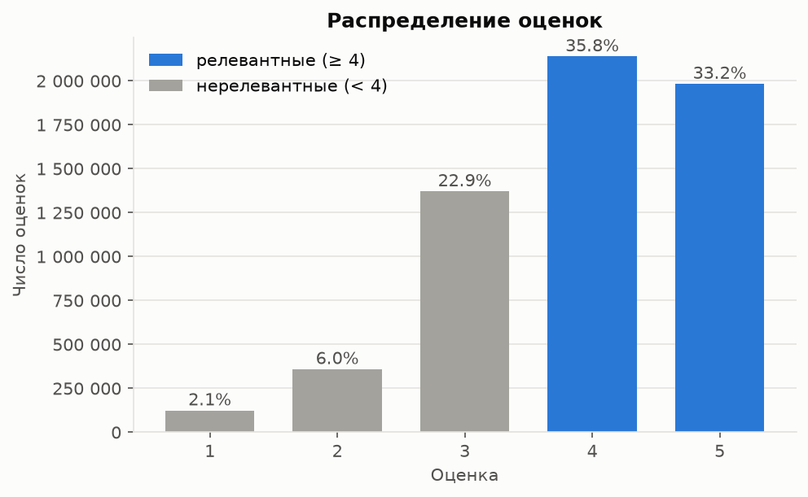
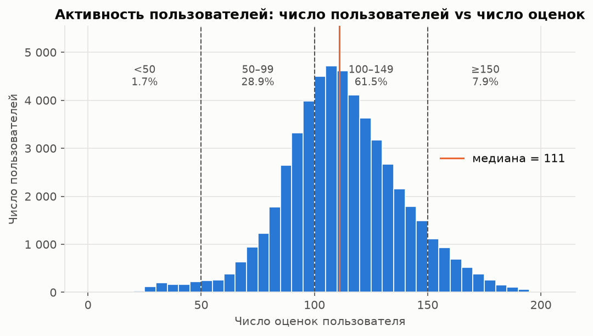
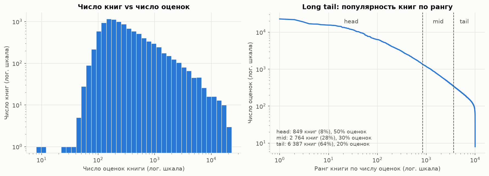
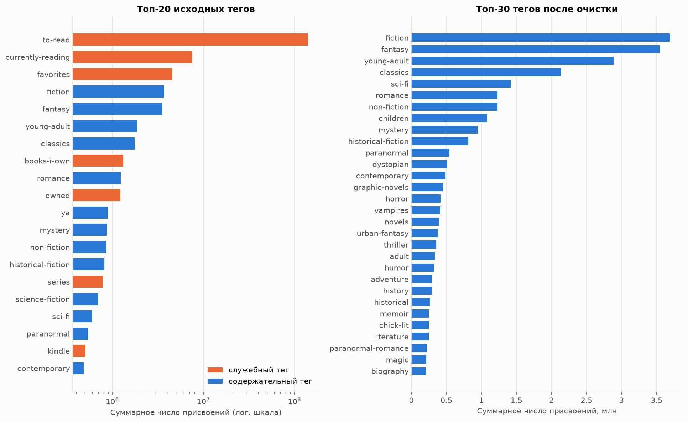

# Прототип книжного рекомендательного сервиса (goodbooks-10k)

## Задача

Построение и сравнение рекомендательных моделей для сервиса подбора книг на датасете goodbooks-10k:

1. Разведочный анализ данных (EDA): распределение оценок, активность пользователей, популярность книг и long tail, теги, проблемы данных (sparsity, popularity bias, cold start).
2. Базовые модели: неперсонализированная Popularity (Top-N по среднему рейтингу с порогом числа оценок) и Content-Based (TF-IDF по названию и тегам, cosine similarity).
3. Item-based Collaborative Filtering на разреженной матрице «пользователь × книга».
4. Matrix Factorization: SVD, оценка ошибки предсказания RMSE.
5. Сравнение top-N моделей по Precision@K, Recall@K, nDCG@K на отложенной выборке.
6. Гибридная стратегия для cold start, выводы и пути улучшения.

## Данные

Согласно инструкции на странице датасета на Kaggle (https://www.kaggle.com/datasets/zygmunt/goodbooks-10k), используется актуальная версия датасета из репозитория автора на GitHub: https://github.com/zygmuntz/goodbooks-10k.

Причина: версия на Kaggle устарела. Она содержит дубликаты оценок и около 980 тыс. оценок, отобранных примерно по 100 на книгу, что искажает распределение популярности книг и активности пользователей. Актуальная версия содержит все оценки без дубликатов, отсортированные по времени; порядок строк позволяет построить временное разбиение на обучающую и тестовую выборки. Статистики со страницы Kaggle относятся к устаревшей версии и в работе не используются.

Лицензия датасета: CC BY-SA 4.0.

| Файл | Строк | Содержимое |
|---|---:|---|
| `ratings.csv` | 5 976 479 | Оценки `user_id, book_id, rating` (1–5), строки упорядочены по времени |
| `books.csv` | 10 000 | Метаданные книг: `book_id`, `goodreads_book_id`, авторы, `original_title`, `title`, год, агрегаты рейтинга |
| `tags.csv` | 34 252 | Справочник тегов `tag_id, tag_name` |
| `book_tags.csv` | 999 912 | Теги книг `goodreads_book_id, tag_id, count` |

Идентификаторы непрерывны: книги 1–10 000, пользователи 1–53 424. Теги связываются с книгами через `books.goodreads_book_id`. Результаты проверки целостности: дубликатов пар `(user_id, book_id)` и пропусков в оценках нет; все ссылки между таблицами корректны; в `book_tags.csv` 8 повторяющихся пар `(goodreads_book_id, tag_id)` и 6 записей с неположительным `count`; у 585 книг отсутствует `original_title`.

## Структура репозитория

```
Rec_Systems_HW1/
├── README.md
├── requirements.txt          # закреплённые версии зависимостей
├── pyproject.toml            # пакет recsys, настройки ruff и pytest
├── scripts/
│   └── download_data.py      # загрузка CSV с GitHub в data/raw/
├── src/recsys/
│   ├── config.py             # пути, RANDOM_STATE, параметры протокола оценки, словари тегов
│   ├── data.py               # загрузка, валидация данных, очистка тегов
│   ├── eda.py                # статистики EDA: активность, популярность, Gini, теги
│   ├── split.py              # per-user temporal split
│   ├── metrics.py            # Precision@K, Recall@K, nDCG@K, MAP@K, HitRate@K, Coverage, Novelty, RMSE
│   ├── evaluation.py         # набор оценки, батчевое формирование top-K, сводные таблицы
│   ├── plots.py              # графики в едином стиле, сохранение в reports/figures/
│   └── models/
│       ├── base.py           # интерфейс Recommender: fit, score, recommend с исключением train
│       ├── popularity.py     # Popularity: средний рейтинг с порогом, weighted rating, count
│       └── content.py        # Content-Based: TF-IDF (название + теги), get_similar_books
├── notebooks/
│   └── goodbooks_recsys.ipynb  # основной ноутбук с результатами
├── tests/                    # тесты метрик, разбиения и моделей (pytest)
├── reports/figures/          # графики для README
└── data/raw/                 # исходные CSV (не входят в репозиторий)
```

## 1. Разведочный анализ данных (EDA)

Подробности (промежуточные таблицы, вспомогательные графики, кривая Лоренца, проверка порядка строк) — ноутбук, раздел 1.

| Показатель | Значение |
|---|---:|
| Оценок / пользователей / книг | 5 976 479 / 53 424 / 10 000 |
| Заполненность матрицы «пользователь × книга» | 1.12 % (sparsity 98.88 %) |
| Средняя / медианная оценка | 3.92 / 4 |
| Доля оценок ≥ 4 | 69.0 % |
| Оценок на пользователя: мин. / медиана / макс. | 19 / 111 / 200 |
| Оценок на книгу: мин. / медиана / макс. | 8 / 248 / 22 806 |
| Gini числа оценок: книги / пользователи | 0.61 / 0.13 |

### 1.1. Распределение оценок



Распределение смещено к высоким оценкам: 4 и 5 — 69.0 %, 1–2 — 8.1 %. Причина — selection bias явных откликов: чаще оцениваются прочитанные и понравившиеся книги. Отсюда порог релевантности `rating ≥ 4`: он отделяет положительный отклик от нейтрального (3) и отрицательного (1–2); при пороге 3 релевантными были бы 92 % оценок, и метрики ранжирования слабо различали бы модели.

### 1.2. Активность пользователей



| Сегмент (число оценок) | Пользователей | Доля пользователей | Доля оценок |
|---|---:|---:|---:|
| `<50` — малоактивные | 899 | 1.7 % | 0.6 % |
| `50–99` | 15 441 | 28.9 % | 22.2 % |
| `100–149` | 32 849 | 61.5 % | 65.7 % |
| `≥150` — активные | 4 235 | 7.9 % | 11.5 % |

Датасет отфильтрован автором: у каждого пользователя не менее 19 оценок, классический cold start пользователей в данных отсутствует. Ближайший к нему сегмент — `<50` (после разбиения 80/20 в train остаётся от 15 оценок). Cold start исследуется через сегментный анализ качества моделей и симуляцию усечением истории пользователя. Средняя оценка снижается с ростом активности (4.00 в нижнем дециле, 3.86 в верхнем) — требуется учёт смещения пользователя (центрирование в Item-based CF, `b_u` в SVD).

### 1.3. Популярность книг и long tail



Популярность книг распределена крайне неравномерно: на топ-10 % книг приходится 53.2 % оценок. По накопленной доле оценок каталог делится на head (849 книг, 8.5 % каталога, 50 % оценок), mid (2 764 книги, 30 % оценок) и long tail (6 387 книг, 63.9 % каталога, 20 % оценок, ≤ 346 оценок на книгу). Следствия: модели склонны рекомендовать head, Popularity baseline силён по точностным метрикам, поэтому дополнительно контролируются Coverage и Novelty; схожести книг из long tail в Item-based CF статистически ненадёжны. Средняя оценка книги от популярности практически не зависит (3.87–3.92 по децилям), поэтому Popularity-модель по среднему рейтингу требует порога минимального числа оценок.

### 1.4. Теги



Теги пользовательские и зашумлены: служебные теги (`to-read`, `currently-reading`, `owned`, `kindle`, `favorites`, `read-in-2015` и т.п.) составляют 44 % записей `book_tags` и 80 % суммарного числа присвоений и не описывают содержание книги. После удаления служебных тегов и нормализации синонимов (`science-fiction` → `sci-fi`, `ya` → `young-adult`) у книги в среднем 53 тега (исходно 100); самые частые — жанровые: `fiction`, `fantasy`, `young-adult`, `classics`, `sci-fi`, `romance`.

### 1.5. Проблемы данных

| Проблема | Проявление | Следствие для моделей |
|---|---|---|
| Sparsity | Заполнено 1.12 % матрицы | `scipy.sparse`; малые пересечения пользователей у пар книг → ненадёжные схожести, shrinkage |
| Popularity bias, long tail | Gini 0.61; 8.5 % книг дают 50 % оценок, 64 % книг — 20 % | Сильный Popularity baseline; риск рекомендаций только из head; контроль Coverage и Novelty |
| Смещение оценок | 69 % оценок ≥ 4 | Порог релевантности 4; учёт смещений пользователя и книги |
| Cold start | В исходных данных отсутствует (≥ 19 оценок на пользователя, ≥ 8 на книгу) | Сегментный анализ; симуляция усечением истории |
| Шум тегов | 80 % присвоений — служебные теги, синонимы | Очистка и нормализация перед TF-IDF |
| Смещение выборки | Каталог — 10 000 самых популярных книг | Метрики оптимистичнее, чем в сервисе с полным каталогом |

Строки `ratings.csv` упорядочены по глобальному времени (оценки пользователя не сгруппированы в блоки), что обосновывает per-user temporal split по порядку строк.

## 2. Протокол оценки, Popularity, Content-Based

Подробности (подбор параметров, промежуточные таблицы, примеры выдачи) — ноутбук, раздел 2.

### 2.1. Разбиение

**Per-user temporal split**: для каждого пользователя последние по порядку строк 20 % оценок (`round(0.2 · n)`, не менее одной) попадают в test, остальные — в train. Колонки времени нет, но порядок строк `ratings.csv` глобально хронологический (раздел 1.5), поэтому модель обучается на прошлом и оценивается на будущем каждого пользователя. В отличие от глобального разреза по времени, у каждого оцениваемого пользователя есть история в train; случайный split менее строгий — он смешивает прошлое и будущее пользователя. Для подбора гиперпараметров то же разбиение применяется к train: train_inner / valid. Test используется только для итогового сравнения моделей.

| Часть | Оценок | Пользователей | Доля оценок ≥ 4 |
|---|---:|---:|---:|
| train | 4 781 208 | 53 424 | 69.1 % |
| test | 1 195 271 | 53 424 | 68.3 % |
| train_inner | 3 824 978 | 53 424 | 69.6 % |
| valid | 956 230 | 53 424 | 67.4 % |

Все статистики моделей (средние, популярность, профили пользователей) строятся только по обучающей части. Тесты `tests/test_split.py` проверяют отсутствие пересечений частей, то, что отложенные оценки пользователя идут позже обучающих, и вложенность valid в train.

### 2.2. Релевантность и метрики

Релевантная книга — книга из отложенной части с оценкой **≥ 4** (обоснование — раздел 1.1). Оцениваются пользователи с хотя бы одной релевантной книгой; для скорости используется фиксированная случайная выборка из **10 000** пользователей (`RANDOM_STATE = 42`), общая для всех моделей. Книги, оценённые пользователем в train, исключаются из рекомендаций. Метрики усредняются по пользователям (macro); K ∈ {5, 10, 20}, основная точка сравнения — K = 10.

| Метрика | Формула | Что измеряет |
|---|---|---|
| Precision@K | \|rec@K ∩ rel\| / K | Долю релевантных книг в выдаче |
| Recall@K | \|rec@K ∩ rel\| / \|rel\| | Долю найденных релевантных книг пользователя |
| nDCG@K | DCG@K / IDCG@K, DCG@K = Σᵢ relᵢ / log₂(i + 1) | Качество с учётом позиции: попадание на 1-м месте весит больше, чем на 10-м |
| MAP@K | среднее AP@K = (1 / min(K, \|rel\|)) · Σᵢ P@i · relᵢ | Точность на позициях попаданий |
| HitRate@K | доля пользователей с ≥ 1 попаданием | Долю пользователей, получивших хотя бы одну полезную рекомендацию |
| Coverage@K | \|∪ᵤ rec@K\| / \|каталог train\| | Разнообразие выдачи по каталогу, popularity bias |
| Novelty@K | среднее −log₂ p(i), p(i) — доля оценок книги в train | Непопулярность рекомендаций: выше — больше long tail |

Детали реализации:

- relᵢ ∈ {0, 1}; IDCG@K — DCG идеального списка, где первые min(K, \|rel\|) позиций заняты релевантными книгами из **всей** отложенной части пользователя, а не из выданного списка (иначе nDCG завышается).
- Знаменатель Recall@K — все релевантные книги пользователя. Среднее \|rel\| в valid — 12.2, поэтому при K = 5 и K = 10 максимум Recall@K для большинства пользователей меньше 1.
- Метрики считаются векторизованно по матрице попаданий (пользователи × позиции) и проверены тестами `tests/test_metrics.py` на примерах с ручным расчётом: зависимость nDCG от порядка, IDCG по всем релевантным, знаменатели Recall и AP, пустые позиции списка.

### 2.3. Popularity

Неперсонализированная модель: один и тот же список для всех пользователей за вычетом прочитанного. Варианты скора книги i (v_i — число оценок в train, R_i — средняя оценка, C — глобальное среднее):

- **mean** (требуемый вариант) — R_i среди книг с v_i ≥ m;
- **weighted rating** (Bayesian average) — WR_i = v_i / (v_i + m) · R_i + m / (v_i + m) · C: средняя оценка сглаживается к C тем сильнее, чем меньше оценок;
- **count** — v_i, контрольный бейзлайн.

Без порога top-10 по среднему рейтингу состоит из книг с единичными оценками 5 (nDCG@10 = 0.0005). Порог m выбран на valid: максимум nDCG@10 при условии, что пул кандидатов заполняет top-10 у всех пользователей. Результат — **m = 7 000** (пул 49 книг, 0.5 % каталога); при m ≥ 8 000 у части пользователей список короче 10. Для weighted rating nDCG@10 выходит на плато при m ≥ 10⁵; при m ≫ v_i ранжирование эквивалентно сортировке по v_i · (R_i − C), т.е. по суммарному превышению оценок книги над глобальным средним. Top-10 варианта mean: шесть книг о Гарри Поттере, «The Help», «A Game of Thrones», «To Kill a Mockingbird», «The Book Thief».

При обучении на полном train (раздел 5) порог m масштабируется пропорционально размеру обучающей выборки.

### 2.4. Content-Based

Текстовый профиль книги — `original_title` (для 585 книг без него — `title`) и очищенные теги (раздел 1.4), каждый тег — один токен (`sci-fi` → `sci_fi`). Параметры `TfidfVectorizer`:

- `stop_words="english"` — служебные слова названий (`the`, `and`, `of`) не создают ложной близости;
- `min_df=2` — токены, встречающиеся в одной книге, не влияют на сходство с другими книгами и исключаются;
- `sublinear_tf=True` — ограничивает вес повторов слова в названии и тегах;
- L2-нормировка: cosine similarity равна скалярному произведению разреженных векторов (`linear_kernel`).

Матрица TF-IDF: 10 000 × 16 836, заполненность 0.31 %, хранится как `csr_matrix`. TF-IDF строится по метаданным всего каталога: оценки пользователей в нём не участвуют, утечки нет.

`get_similar_books(book_id, N=5)` возвращает N книг с наибольшей cosine similarity, исключая саму книгу. Пример для «The Hunger Games»:

| # | Книга | Similarity |
|---:|---|---:|
| 1 | Catching Fire (The Hunger Games, #2) | 0.81 |
| 2 | Mockingjay (The Hunger Games, #3) | 0.81 |
| 3 | The Hunger Games Trilogy Boxset | 0.77 |
| 4 | Divergent (Divergent, #1) | 0.52 |
| 5 | Legend (Legend, #1) | 0.48 |

Первые позиции — продолжения серии (близость по словам названия и тегу серии), далее — книги того же жанра (young adult, dystopian). Для «Pride and Prejudice» — романы Джейн Остин и «Wuthering Heights», для «The Hobbit» — книги Толкина.

Для сравнения с другими моделями по метрикам top-N используется персонализированный вариант: профиль пользователя — сумма TF-IDF векторов книг, оценённых в train на 4–5, с весом-оценкой; скор книги — скалярное произведение с профилем. Число тегов в профиле книги выбрано на valid: nDCG@10 растёт с 0.016 (5 тегов) до 0.053 (50 тегов) и далее не меняется; используются все теги.

### 2.5. Результаты на valid (K = 10)

| Модель | Precision@10 | Recall@10 | nDCG@10 | MAP@10 | HitRate@10 | Coverage@10 | Novelty@10 |
|---|---:|---:|---:|---:|---:|---:|---:|
| Popularity (mean, m = 7 000) | 0.0386 | 0.0323 | 0.0417 | 0.0208 | 0.213 | 0.4 % | 8.46 |
| Popularity (weighted, m = 10⁵) | 0.0386 | 0.0323 | 0.0441 | 0.0219 | 0.204 | 0.4 % | 8.40 |
| Popularity (count) | 0.0348 | 0.0291 | 0.0383 | 0.0159 | 0.208 | 0.5 % | 8.19 |
| Content-Based | **0.0474** | **0.0411** | **0.0536** | **0.0238** | **0.294** | **48.8 %** | **12.14** |

- Content-Based превосходит все варианты Popularity по всем метрикам: nDCG@10 выше на 22 % относительно лучшего варианта Popularity, HitRate@10 — 29 % пользователей против 20–21 %. Причина — последовательное чтение серий и авторов: после первой книги серии релевантны продолжения, а они близки по названию и тегам.
- Popularity рекомендует 39–47 книг на весь каталог (Coverage@10 < 0.5 %), Content-Based — 49 % каталога. Novelty@10 — 12.1 бит против 8.2–8.5: среднее число оценок у рекомендованных книг Content-Based в 5 раз меньше (2 227 против 11 352 у варианта mean).
- Абсолютные значения метрик невелики: каталог — 10 000 книг, у пользователя в среднем 12 релевантных книг в valid, а задача — предсказание будущих, а не случайно скрытых оценок.

## Воспроизведение

Требования: Python 3.14 (Windows, x86-64); проверено на Python 3.14.3.

```bash
git clone https://github.com/a-kapset/Rec_Systems_HW1.git
cd Rec_Systems_HW1
python -m venv .venv
.venv\Scripts\activate            # Linux/macOS: source .venv/bin/activate
pip install -r requirements.txt
pip install -e .
```

Получение данных (файлы сохраняются в `data/raw/`):

- автоматически: `python scripts/download_data.py` — загрузка `ratings.csv`, `books.csv`, `tags.csv`, `book_tags.csv` из репозитория https://github.com/zygmuntz/goodbooks-10k с проверкой числа строк; уже загруженные файлы пропускаются;
- вручную: скачать те же четыре файла из репозитория https://github.com/zygmuntz/goodbooks-10k и поместить в каталог `data/raw/`.

Тесты метрик, разбиения и моделей:

```bash
pytest
```

Проверка загрузки и целостности данных:

```bash
python -c "from recsys import data; print(data.validate(data.load_all()))"
```

Выполнение ноутбука с обновлением графиков в `reports/figures/`:

```bash
jupyter nbconvert --to notebook --execute --inplace notebooks/goodbooks_recsys.ipynb
```
