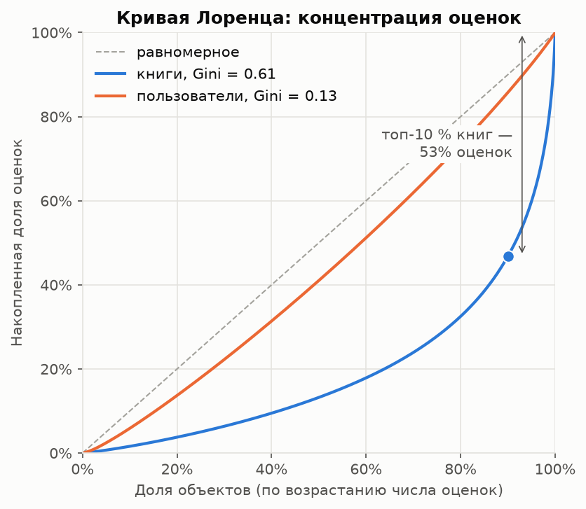
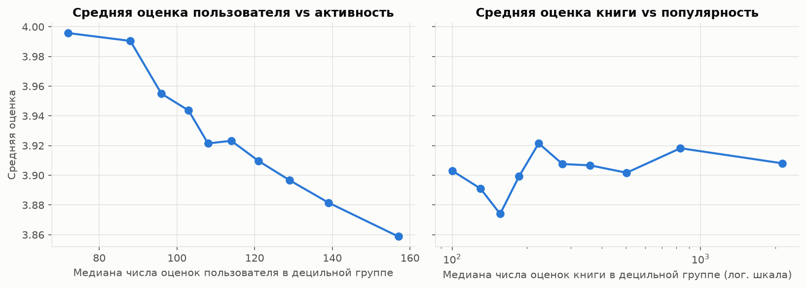

# Прототип книжного рекомендательного сервиса (goodbooks-10k)

## Задача

Построение и сравнение рекомендательных моделей для сервиса подбора книг на датасете goodbooks-10k:

1. Разведочный анализ данных (EDA): распределение оценок, активность пользователей, популярность книг и long tail, теги, проблемы данных (sparsity, popularity bias, cold start).
2. Базовые модели: неперсонализированная Popularity (Top-N по среднему рейтингу с порогом числа оценок) и Content-Based (TF-IDF по названию и тегам, cosine similarity).
3. Item-based Collaborative Filtering на разреженной матрице «пользователь × книга».
4. Matrix Factorization: SVD, оценка ошибки предсказания RMSE.
5. Сравнение top-N моделей по Precision@K, Recall@K, nDCG@K на отложенной выборке.
6. Гибридная стратегия для cold start, выводы и пути улучшения.

## Данные

Согласно инструкции на странице датасета на Kaggle (https://www.kaggle.com/datasets/zygmunt/goodbooks-10k), используется актуальная версия датасета из репозитория автора на GitHub: https://github.com/zygmuntz/goodbooks-10k.

Причина: версия на Kaggle устарела. Она содержит дубликаты оценок и около 980 тыс. оценок, отобранных примерно по 100 на книгу, что искажает распределение популярности книг и активности пользователей. Актуальная версия содержит все оценки без дубликатов, отсортированные по времени; порядок строк позволяет построить временное разбиение на обучающую и тестовую выборки. Статистики со страницы Kaggle относятся к устаревшей версии и в работе не используются.

Лицензия датасета: CC BY-SA 4.0.

| Файл | Строк | Содержимое |
|---|---:|---|
| `ratings.csv` | 5 976 479 | Оценки `user_id, book_id, rating` (1–5), строки упорядочены по времени |
| `books.csv` | 10 000 | Метаданные книг: `book_id`, `goodreads_book_id`, авторы, `original_title`, `title`, год, агрегаты рейтинга |
| `tags.csv` | 34 252 | Справочник тегов `tag_id, tag_name` |
| `book_tags.csv` | 999 912 | Теги книг `goodreads_book_id, tag_id, count` |

Идентификаторы непрерывны: книги 1–10 000, пользователи 1–53 424. Теги связываются с книгами через `books.goodreads_book_id`. Результаты проверки целостности: дубликатов пар `(user_id, book_id)` и пропусков в оценках нет; все ссылки между таблицами корректны; в `book_tags.csv` 8 повторяющихся пар `(goodreads_book_id, tag_id)` и 6 записей с неположительным `count`; у 585 книг отсутствует `original_title`.

## Структура репозитория

```
Rec_Systems_HW1/
├── README.md
├── requirements.txt          # закреплённые версии зависимостей
├── pyproject.toml            # пакет recsys, настройки ruff и pytest
├── scripts/
│   └── download_data.py      # загрузка CSV с GitHub в data/raw/
├── src/recsys/
│   ├── config.py             # пути, RANDOM_STATE, параметры протокола оценки, словари тегов
│   ├── data.py               # загрузка, валидация данных, очистка тегов
│   ├── eda.py                # статистики EDA: активность, популярность, Gini, теги
│   └── plots.py              # графики в едином стиле, сохранение в reports/figures/
├── notebooks/
│   └── goodbooks_recsys.ipynb  # основной ноутбук с результатами
├── reports/figures/          # графики для README
└── data/raw/                 # исходные CSV (не входят в репозиторий)
```

## 1. Разведочный анализ данных (EDA)

Расчёты — `src/recsys/eda.py`, графики — `src/recsys/plots.py`, результаты — раздел 1 ноутбука `notebooks/goodbooks_recsys.ipynb`.

### 1.1. Общая статистика и распределение оценок

| Показатель | Значение |
|---|---:|
| Оценок | 5 976 479 |
| Пользователей | 53 424 |
| Книг | 10 000 |
| Заполненность матрицы «пользователь × книга» | 1.12 % |
| Sparsity | 98.88 % |
| Средняя / медианная оценка | 3.92 / 4 |
| Доля оценок ≥ 4 | 69.0 % |


Распределение смещено к высоким оценкам: 4 и 5 — 35.8 % и 33.2 %, 1–2 — 8.1 %. Причина — selection bias явных откликов: чаще оцениваются прочитанные и понравившиеся книги. Отсюда порог релевантности `rating ≥ 4`: он отделяет положительный отклик от нейтрального (3) и отрицательного (1–2); при пороге 3 релевантными были бы 92 % оценок, и метрики ранжирования слабо различали бы модели.

### 1.2. Активность пользователей


Число оценок на пользователя — от 19 до 200, медиана 111, 10 % пользователей имеют ≤ 82 оценок, 10 % — ≥ 146. Распределение близко к симметричному (Gini 0.13): датасет отфильтрован автором, пользователей с единичными оценками нет, классический cold start пользователей в исходных данных отсутствует.

| Сегмент (число оценок) | Пользователей | Доля пользователей | Доля оценок | Средняя оценка |
|---|---:|---:|---:|---:|
| `<50` — малоактивные | 899 | 1.7 % | 0.6 % | 3.85 |
| `50–99` | 15 441 | 28.9 % | 22.2 % | 3.99 |
| `100–149` | 32 849 | 61.5 % | 65.7 % | 3.91 |
| `≥150` — активные | 4 235 | 7.9 % | 11.5 % | 3.85 |

Сегмент `<50` наиболее близок к cold start (после разбиения 80/20 в train остаётся от 15 оценок). Cold start пользователей далее исследуется через сегментный анализ качества моделей и симуляцию усечением истории при оценке гибридной модели.

### 1.3. Популярность книг и long tail




Число оценок книги — от 8 до 22 806, медиана 248. Концентрация оценок высокая: Gini 0.61 (у пользователей — 0.13); на топ-1 % книг приходится 17.1 % оценок, на топ-10 % — 53.2 %, на топ-20 % — 67.5 %. Разбиение каталога по накопленной доле оценок:

| Сегмент | Книг | Доля каталога | Доля оценок | Оценок на книгу |
|---|---:|---:|---:|---:|
| head (первые 50 % оценок) | 849 | 8.5 % | 50.0 % | 1 348–22 806 |
| mid (50–80 %) | 2 764 | 27.6 % | 30.0 % | 346–1 347 |
| long tail (последние 20 %) | 6 387 | 63.9 % | 20.0 % | 8–346 |

Следствия: popularity bias — модели склонны рекомендовать head, Popularity baseline силён по точностным метрикам, поэтому дополнительно контролируются Coverage и Novelty; для книг long tail оценок мало, и их схожести в Item-based CF статистически ненадёжны. Cold start книг выражен слабо (книг с < 50 оценками — 9): каталог ограничен 10 000 самых популярных книг Goodreads.

### 1.4. Теги


Теги пользовательские и зашумлены: служебные теги (статус чтения `to-read`, `currently-reading`; владение `owned`, `books-i-own`; формат `kindle`, `audiobook`; личные оценки и списки `favorites`, `5-stars`, `read-in-2015`) составляют 44 % записей `book_tags` и 80 % суммарного числа присвоений. Очистка (`data.clean_book_tags`): стоп-список и регулярные шаблоны из `config.py`, удаление тегов без латинских букв и записей с неположительным `count`, нормализация синонимов (`science-fiction` → `sci-fi`, `ya` → `young-adult`), суммирование повторяющихся пар. После очистки — 28 830 тегов, медиана 53 тега на книгу (исходно 100). Самые частые теги — жанровые: `fiction`, `fantasy`, `young-adult`, `classics`, `sci-fi`, `romance`, `non-fiction`, `children`, `mystery`.

### 1.5. Дополнительные наблюдения



- Средняя оценка пользователя снижается с ростом активности (4.00 в нижнем дециле, 3.86 в верхнем): требуется учёт смещения пользователя (центрирование в Item-based CF, `b_u` в SVD).
- Средняя оценка книги от популярности практически не зависит (3.87–3.92 по децилям): популярность и средний рейтинг — разные сигналы; Popularity-модель по среднему рейтингу требует порога минимального числа оценок.
- Порядок строк: оценки пользователя не сгруппированы в блоки (в среднем 53.6 непрерывных блока на пользователя, медианный размах позиций — 31.5 % длины файла), т.е. строки упорядочены по глобальному времени, и per-user temporal split по порядку строк корректен.

### 1.6. Проблемы данных

| Проблема | Проявление | Следствие для моделей |
|---|---|---|
| Sparsity | Заполнено 1.12 % матрицы | `scipy.sparse`; малые пересечения пользователей у пар книг → ненадёжные схожести, shrinkage |
| Popularity bias, long tail | Gini 0.61; 8.5 % книг дают 50 % оценок, 64 % книг — 20 % | Сильный Popularity baseline; риск рекомендаций только из head; контроль Coverage и Novelty |
| Смещение оценок | 69 % оценок ≥ 4 | Порог релевантности 4; учёт смещений пользователя и книги |
| Cold start | В исходных данных отсутствует (≥ 19 оценок на пользователя, ≥ 8 на книгу) | Сегментный анализ; симуляция усечением истории |
| Шум тегов | 80 % присвоений — служебные теги, синонимы | Очистка и нормализация перед TF-IDF |
| Смещение выборки | Каталог — 10 000 самых популярных книг | Метрики оптимистичнее, чем в сервисе с полным каталогом |

## Воспроизведение

Требования: Python 3.14 (Windows, x86-64); проверено на Python 3.14.3.

```bash
git clone https://github.com/a-kapset/Rec_Systems_HW1.git
cd Rec_Systems_HW1
python -m venv .venv
.venv\Scripts\activate            # Linux/macOS: source .venv/bin/activate
pip install -r requirements.txt
pip install -e .
```

Получение данных (файлы сохраняются в `data/raw/`):

- автоматически: `python scripts/download_data.py` — загрузка `ratings.csv`, `books.csv`, `tags.csv`, `book_tags.csv` из репозитория https://github.com/zygmuntz/goodbooks-10k с проверкой числа строк; уже загруженные файлы пропускаются;
- вручную: скачать те же четыре файла из репозитория https://github.com/zygmuntz/goodbooks-10k и поместить в каталог `data/raw/`.

Проверка загрузки и целостности данных:

```bash
python -c "from recsys import data; print(data.validate(data.load_all()))"
```

Выполнение ноутбука с обновлением графиков в `reports/figures/`:

```bash
jupyter nbconvert --to notebook --execute --inplace notebooks/goodbooks_recsys.ipynb
```
